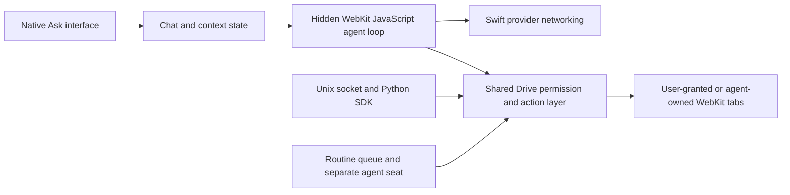
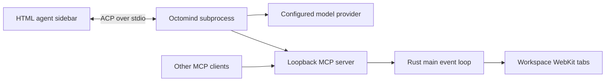
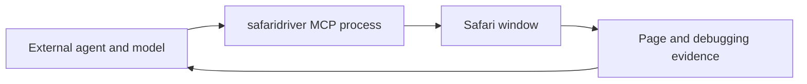

**Search, Octoweb, Aside Browser, and Safari MCP: design and architecture comparison**

Inspected September 28, 2026. This review covers product interaction, interface construction, browser automation, agent execution, context, permissions, and maintenance. Search means this checkout's current working tree, including uncommitted additions. Octoweb means public source at commit `f61a40a29c88d347b2a873b6e97fe7b0c67d2a49`, whose manifest identifies version 0.16.0. Aside means the installed 1.0.928.1 app, its documented interfaces, and first-party architecture descriptions.

Three GPT-6 Luna research agents investigated the projects independently. Search and Octoweb were inspected at source level. Aside was inspected through signed bundle metadata, its extension manifest, CLI documentation, and its visible interface. Aside's proprietary implementation was not decompiled. Search and Octoweb were not launched or benchmarked. The Octoweb website screenshot is a marketing page, not a running browser. Accordingly, architectural conclusions are stronger than claims about real-world task success or visual polish under use.

The focused follow-up on Aside's June article, newer models, and Search's existing background viewport is in [aside-article-assessment-2026-09-28.md](/Users/winter/Documents/GitHub/Search/Runtime/ask/design/aside-article-assessment-2026-09-28.md).

**Assessment.** The intended goal is to compete with Aside as a complete agent browser. Search already has substantial browser control, native task UI, explicit tab access, and routine infrastructure. Octoweb is its closest architectural peer. Aside supplies the broadest documented task environment. Safari MCP increases the availability of browser control to outside agents. Search should keep its existing foundations and invest in reliable completion, longer tasks, reusable context, and recovery. A quiet native interface can distinguish the product, but its competitive value depends on everyday task results.

| Decision | Search, current checkout | Octoweb | Aside | Safari MCP |
|---|---|---|---|---|
| Browser engine | System WebKit | System WebKit through Rust/wry | Bundled Chromium | Safari's WebKit |
| Browser interface | SwiftUI/AppKit and native Fluid controls | HTML/CSS/JS controls in WebViews | Chromium chrome and MV3 agent extension | Existing Safari window |
| Model execution | Hidden WKWebView loop and Swift networking | Octomind subprocess over ACP | Local proprietary agent runtime | External MCP client supplies the agent |
| External integration | Unix socket, Python SDK, CLI | Streamable HTTP MCP | CLI, MCP, Playwright-style REPL | Local safaridriver MCP process |
| Context | Tab grants, attachments, transcripts | Page-text index and optional learning | Documented local memory and site skills | Page inspection; broader context belongs to client |
| Human review | Shared guard and native cards | A2UI decisions and skill instructions | Permission UI and described action review | Developer opt-in; per-action gate undocumented |
| Scheduled work | Routine queue and second agent seat | Octomind workflows/schedules | Saved routines through task APIs | Client responsibility |
| Primary maintenance cost | Native UI, WebKit differences, own protocol | Window coordination and external runtime | Chromium fork, extension, runtime/services | Apple's browser/driver; client owns agent behavior |

The engine and interface facts are established by [Search's package](/Users/winter/Documents/GitHub/Search/Package.swift:1), [Octoweb's Cargo manifest](https://github.com/muvon/octoweb/blob/f61a40a29c88d347b2a873b6e97fe7b0c67d2a49/Cargo.toml#L10-L45), and [Aside's installed bundle metadata](/Applications/Aside.app/Contents/Info.plist). Aside's bundled agent interface declares a service worker, main page, side panel, and new-tab override in its [extension manifest](</Applications/Aside.app/Contents/Frameworks/Aside Framework.framework/Versions/1.0.928.1/Libraries/AsideAgentManager/manifest.json>).

**How Search works.** `Browser` owns tabs, selection, and browser lifecycle. Each `Tab` creates its WKWebView lazily, with isolated private storage and persistent storage by space. SwiftUI draws the browser controls, AppKit handles window and input behavior, and WebKit runs websites. There are no Swift package dependencies. Search also implements Chrome-extension compatibility using Apple's WKWebExtension engine and native shims, which carries an ongoing compatibility burden. [Browser.swift](/Users/winter/Documents/GitHub/Search/Sources/Search/Browser.swift:9), [Tab.swift](/Users/winter/Documents/GitHub/Search/Sources/Search/Tab.swift:81), [Extensions.swift](/Users/winter/Documents/GitHub/Search/Sources/Search/Extensions.swift:6).

`Mind` persists chats, attachments, and model settings. `Harness` runs the provider/tool loop and streams events back to the native interface. Swift owns network requests and injects credentials for approved provider hosts, so the JavaScript loop does not need the API key. The same `Drive` operation layer serves the in-app agent, external socket sessions, and scheduled runs. This is a substantial implemented agent system. [Mind.swift](/Users/winter/Documents/GitHub/Search/Sources/Search/Mind.swift:460), [Harness.swift](/Users/winter/Documents/GitHub/Search/Sources/Search/Harness.swift:276), [harness.js](/Users/winter/Documents/GitHub/Search/Runtime/ask/harness.js:830), [Drive.swift](/Users/winter/Documents/GitHub/Search/Sources/Search/Drive.swift:567).

Context access is deliberate. Tab chips grant access to user tabs; a model cannot grant itself a tab by putting a consent flag in tool arguments. File, image, and website attachments carry context and do not automatically grant browser access. Search persists transcripts, but the inspected implementation has no general semantic memory or page-content history index. This is a material gap for repeated tasks. [SDK.md](/Users/winter/Documents/GitHub/Search/Runtime/ask/SDK.md:139), [AskAttach.swift](/Users/winter/Documents/GitHub/Search/Sources/Search/AskAttach.swift:35), [harness.js](/Users/winter/Documents/GitHub/Search/Runtime/ask/harness.js:727).

Search's right rail and separate Ask window reuse the stream, composer, and approvals with two density settings. The current code includes a chat/automation navigation sidebar, folded activity, new-tab chat and automation cards, and native routine forms. These should not be listed as future features merely because an older design document says they are missing. [AskParts.swift](/Users/winter/Documents/GitHub/Search/Sources/Search/AskParts.swift:12), [AskPage.swift](/Users/winter/Documents/GitHub/Search/Sources/Search/AskPage.swift:64), [NewTab.swift](/Users/winter/Documents/GitHub/Search/Sources/Search/NewTab.swift:13), [Omnibox.swift](/Users/winter/Documents/GitHub/Search/Sources/Search/Omnibox.swift:50).

**How Octoweb works.** Rust owns browser state and window coordination. The browser window, transparent child chrome window, command overlay, and WebViews work together. The sidebar, palette, new-tab page, and other controls are HTML/CSS/JS. Its Mac appearance comes from shared CSS tokens and AppKit behavior, rather than SwiftUI widgets. [main.rs](https://github.com/muvon/octoweb/blob/f61a40a29c88d347b2a873b6e97fe7b0c67d2a49/src/main.rs#L737-L829), [theme.rs](https://github.com/muvon/octoweb/blob/f61a40a29c88d347b2a873b6e97fe7b0c67d2a49/src/theme.rs#L1-L33).

Octoweb starts an Octomind subprocess for an agent session. ACP carries prompts, streamed text, and tool status. The model loop lives in Octomind. Browser tools arrive through a loopback MCP server and enter the browser's event loop. External clients can use that server without adopting Octomind. This separation is useful for interoperability, with an extra runtime installation and configuration step as its cost. [acp.rs](https://github.com/muvon/octoweb/blob/f61a40a29c88d347b2a873b6e97fe7b0c67d2a49/src/acp.rs#L194-L273), [mcp.rs](https://github.com/muvon/octoweb/blob/f61a40a29c88d347b2a873b6e97fe7b0c67d2a49/src/mcp.rs#L2218-L2307).

Workspaces have separate WebKit stores and agent sessions. A local inverted index retains up to 2,000 pages, each with at most 6,000 bytes of visible text after UTF-8-safe truncation. The palette and agent can search that content. This is bounded text retrieval, distinct from the optional background agent that derives memories through Octomind. The learning process is disabled by default. A Later queue expires saved links and removes an item when opened, while indexed page text remains subject to the index's own retention. [workspace.rs](https://github.com/muvon/octoweb/blob/f61a40a29c88d347b2a873b6e97fe7b0c67d2a49/src/workspace.rs#L203-L218), [page_index.rs](https://github.com/muvon/octoweb/blob/f61a40a29c88d347b2a873b6e97fe7b0c67d2a49/src/page_index.rs#L1-L20), [later.rs](https://github.com/muvon/octoweb/blob/f61a40a29c88d347b2a873b6e97fe7b0c67d2a49/src/later.rs#L1-L5), [config.rs](https://github.com/muvon/octoweb/blob/f61a40a29c88d347b2a873b6e97fe7b0c67d2a49/src/config.rs#L436-L446).

Octoweb supports declarative A2UI forms, cards, controls, and live views inside chat. This goes beyond Search's fixed question and approval components. A general renderer is useful when multiple tasks repeatedly need structured forms, but it also needs schema validation, bindings, URL restrictions, event handling, and persistence. Search already covers basic human decisions without implementing this whole system. [a2ui.rs](https://github.com/muvon/octoweb/blob/f61a40a29c88d347b2a873b6e97fe7b0c67d2a49/src/a2ui.rs), [sidebar_html.rs](https://github.com/muvon/octoweb/blob/f61a40a29c88d347b2a873b6e97fe7b0c67d2a49/src/sidebar_html.rs#L1-L43), [AskUI.swift](/Users/winter/Documents/GitHub/Search/Sources/Search/AskUI.swift:807).

**How Aside works.** The installed bundle establishes a Chromium browser and a Manifest V3 agent extension with main and side-panel pages. Its declared capabilities include debugger, tabs, history, cookies, scripting, downloads, native messaging, and all-site access. These declarations show available capability, not active collection. The visible browser uses conventional horizontal tabs, groups, pinned tabs, an address toolbar, and extension controls. Its agent workspace adds chats, projects, activity, context/model/permission controls, previews, and a side chat. [Installed extension manifest](</Applications/Aside.app/Contents/Frameworks/Aside Framework.framework/Versions/1.0.928.1/Libraries/AsideAgentManager/manifest.json>).

Aside publishes a design based on pi-mono/core with custom runtime facilities and two core tools, JavaScript REPL and bash. Asidewright presents a Playwright-shaped interface over CDP, with asynchronous browser signals and visual fallback. The company describes Blink patches for background agent tabs and a fixed 1440 by 900 agent viewport. These internals are vendor descriptions, not source-audited findings. [Aside architecture article](https://aside.com/blog/how-we-built-the-sota-browser-agent-that-outperforms-fable).

The CLI and REPL provide task sessions, explicit tab attachment, snapshots, locators, screenshots, and downloads. Installed skill documentation also exposes projects, routines, and remote hosts. Its public memory interface describes local Markdown files, context extracted from tasks, and remembered site procedures. This makes repeated work more convenient than Search's current attachment-based context flow. The specific persistence, encryption, and approval implementation remain proprietary. [Developer interfaces](https://aside.com/blog/developers), [Memory interface](https://aside.com/features/memory).

Aside's help documents editable memory with retention choices, vault-assisted login, and user handoff for MFA, passkeys, CAPTCHA, and identity checks. Its routine types are distinct: cron starts a new task, while heartbeat continues an existing chat. The documentation says overlapping runs are skipped and an unavailable target chat pauses a routine. It does not establish execution while the app is closed or the host is asleep, missed-run recovery, rollback, or exact scheduling precision. These remain unknowns, rather than established advantages over Search. [Memory help](https://docs.aside.com/help/memory), [Password Manager help](https://docs.aside.com/help/password-manager), [Task help](https://docs.aside.com/help/tasks), [Routine help](https://docs.aside.com/help/automation).

**Automation fidelity and permission differences.** Both WebKit projects resolve targets in page scripts, check actionability, and deliver native pointer/key input. Neither is limited to `dispatchEvent` clicks. Search defaults to native click/type/press with an explicit JavaScript tier; Octoweb uses native click/hover/key with a mixed typing path. Both also have JavaScript value-setting operations. Engine choice alone therefore does not establish which will finish a task more reliably. [Search Drive](/Users/winter/Documents/GitHub/Search/Sources/Search/Drive.swift:1649), [drive.js](/Users/winter/Documents/GitHub/Search/Runtime/ask/drive.js:601), [Octoweb native input](https://github.com/muvon/octoweb/blob/f61a40a29c88d347b2a873b6e97fe7b0c67d2a49/src/native_input.rs#L1-L19), [Octoweb typing](https://github.com/muvon/octoweb/blob/f61a40a29c88d347b2a873b6e97fe7b0c67d2a49/src/mcp.rs#L786-L830).

Both DOM snapshot implementations traverse same-origin frames and open shadow roots. Cross-origin frames and closed shadow roots remain limits. Search additionally exposes WebKit Inspector execution contexts, which can provide deeper diagnostics across frame origins on supported builds. This does not make its normal snapshot automatically cover those frames. Aside documents iframe-aware snapshots, but this review did not establish equivalent coverage limits. [Search inspector notes](/Users/winter/Documents/GitHub/Search/Runtime/ask/INSPECTION.md:61), [Octoweb snapshot](https://github.com/muvon/octoweb/blob/f61a40a29c88d347b2a873b6e97fe7b0c67d2a49/src/snapshot_js.rs#L1-L20).

Search already houses background agent views in a fixed 1280 by 800 offscreen window that avoids becoming key/main. Foreground attached tabs retain the visible page layout. Its socket emits browser lifecycle events, while no equivalent browser-event injection into the in-app model loop was found. Stable background rendering and model-visible event delivery therefore have different levels of implementation. [Offscreen host](/Users/winter/Documents/GitHub/Search/Sources/Search/Bench.swift:2026), [Event emission](/Users/winter/Documents/GitHub/Search/Sources/Search/Drive.swift:2093).

Search's guarded mode gates operations centrally and rechecks page evidence before dispatch. Full mode deliberately relaxes review. Arbitrary JavaScript is a broad approved capability; internal actions within an approved code call do not each return through the native guard. External socket clients default to full mode, are same-user only, and receive an approval-required error when an operation cannot proceed under a restricted mode. Tab consent remains separate. These qualifications matter when calling Search's guard stronger than a prompt convention. [Drive.swift](/Users/winter/Documents/GitHub/Search/Sources/Search/Drive.swift:567), [AskPolicy.swift](/Users/winter/Documents/GitHub/Search/Sources/Search/AskPolicy.swift:149), [Protocol](/Users/winter/Documents/GitHub/Search/Runtime/ask/PROTOCOL.md:28).

Octoweb's browser skill instructs agents to request approval before consequential submissions. Its `render_ui` tool blocks for a user response, but browser click, JavaScript, and form-submit tools do not universally require that response. Its workspace tokens route requests, rather than authenticate every client. Loopback binding and Origin validation restrict webpage callers, while a local client without an Origin can use the default workspace. Search's socket and Octoweb's MCP endpoint therefore have different local-client boundaries. [Octoweb browser skill](https://github.com/muvon/octoweb/blob/f61a40a29c88d347b2a873b6e97fe7b0c67d2a49/tap/skills/browser-tasks/SKILL.md#L34-L36), [render_ui](https://github.com/muvon/octoweb/blob/f61a40a29c88d347b2a873b6e97fe7b0c67d2a49/src/mcp.rs#L246-L261), [Workspace routing](https://github.com/muvon/octoweb/blob/f61a40a29c88d347b2a873b6e97fe7b0c67d2a49/src/mcp.rs#L2041-L2093).

Local browser or transcript storage does not imply local inference. Search and Octoweb send selected context to the configured provider. Aside's privacy policy explicitly says hosted models can receive prompts, selected snapshots/screenshots/files, tool results, and responses. Its broad homepage language should not replace that more precise description. [Search credential/network bridge](/Users/winter/Documents/GitHub/Search/Sources/Search/Harness.swift:276), [Aside privacy policy](https://aside.com/policy/privacy).

**Interface judgment.** Search's native controls offer a coherent Mac design. Neutral tokens, compact controls, and shared rail/page components make chat belong to the browser. The rail takes 380 points and resizes the page; that preserves visibility but can change a site's responsive layout. Its small rail text and tool details deserve usability checks. The separate Ask page already supplies a roomier reading layout. To compete with Aside, both layouts should make running work, blocked work, and reviewable results easy to find. [App.swift](/Users/winter/Documents/GitHub/Search/Sources/Search/App.swift:358), [AskParts.swift](/Users/winter/Documents/GitHub/Search/Sources/Search/AskParts.swift:12), [Fluid.swift](/Users/winter/Documents/GitHub/Search/Sources/Search/Fluid.swift:23).

Octoweb emphasizes a command palette, shortcuts, ten quick slots, and selection-aware actions. This is efficient for users willing to learn the commands, with lower discoverability as the cost. Its sidebar overlays the page and is resizable, so opening it preserves page layout while covering some content. CSS uses rounded panels, system typography, accent colors, and material-like fills. Although labeled Liquid Glass, the shared source deliberately makes floating panel fills opaque to avoid inconsistent compositing. A fair visual ranking needs the running application. [Sidebar code](https://github.com/muvon/octoweb/blob/f61a40a29c88d347b2a873b6e97fe7b0c67d2a49/src/sidebar_html.rs#L1-L43), [Theme code](https://github.com/muvon/octoweb/blob/f61a40a29c88d347b2a873b6e97fe7b0c67d2a49/src/theme.rs#L44-L60).

Aside makes agent tasks easy to find within a familiar browser. Separate agent tabs, status badges, projects, and a full task workspace support ongoing work. The visible interface carries more controls and competing columns than Search. Search already shares its useful folded-activity, composer-context, and full-chat patterns, so adding more task navigation should be driven by a concrete missing workflow.

The README and older design status notes should describe the current Ask, routine, new-tab, and external-agent capabilities accurately. Source inspection establishes that this work exists; it does not establish that the heavily modified checkout is release-ready.

**What Safari MCP adds.** Apple's entry point is `safaridriver --mcp`, available in Safari 27 and Technology Preview 247 after developer settings opt-in. Its 17 tools cover tabs, page content, interactions, screenshots, JavaScript, network, console, dialogs, viewport, and media emulation. Apple describes local execution, excludes personal Safari information such as AutoFill and other browsing activity, and sends captured content to the chosen agent. The announcement publishes tool descriptions but does not provide full schemas or element-reference semantics. [WebKit announcement](https://webkit.org/blog/18136/introducing-the-safari-mcp-server-for-web-developers/).

The documented endpoint targets Safari. Nothing in the reviewed material establishes that it can attach to Search-owned WKWebViews. Web Inspector separately supports inspectable WKWebViews, and Search already has its own inspector bridge. Reusing Apple's MCP command would control Safari rather than provide Search with a drop-in adapter. An MCP adapter over Drive remains the direct way to expose Search's own tabs and policy. [Web Inspector documentation](https://webkit.org/web-inspector/enabling-web-inspector/), [Search inspection guide](/Users/winter/Documents/GitHub/Search/Runtime/ask/INSPECTION.md:38).

Apple documents isolation and trusted input for ordinary WebDriver automation. Those are useful reference behaviors, but the reviewed MCP announcement does not establish the exact mapping of its tools to WebDriver commands or its session lifecycle. I found no official MCP-specific implementation or complete schema in the reviewed sources. This limits source-level reverse engineering of Safari's adapter. [Apple WebDriver overview](https://developer.apple.com/documentation/webkit/about-webdriver-for-safari), [Public WebDriver implementation](https://github.com/WebKit/WebKit/blob/main/Source/WebDriver/WebDriverService.cpp).

My competitive inference is that standard browser control is becoming easier to obtain. Safari supplies a developer-facing route, and Octoweb supplies an app-owned MCP route. A complete Aside competitor must also own the experience of starting, continuing, reviewing, and repeating work. MCP standardizes access; it does not supply memory, task recovery, outcome verification, or the browser's task interface.

**Where Search stands against that goal.** The current tool list is already extensive. Search has background agent tabs, a Keep action that hands over the same live page, native input, snapshots, inspector diagnostics, dialogs and uploads, questions, approvals, and scheduled jobs. These are existing investments to improve and test. [Model tools](/Users/winter/Documents/GitHub/Search/Runtime/ask/harness.js:221), [Live handoff](/Users/winter/Documents/GitHub/Search/Runtime/ask/INSPECTION.md:19).

| Requirement | Existing Search behavior | Gap relevant to competing with Aside |
|---|---|---|
| Complete longer tasks | Steering, stop, questions, tool streaming | 25 model-round ceiling; no durable task plan/checkpoint |
| Preserve useful context | Full local transcripts and attachments | Model replays only 30 messages; no token-aware compaction or retrieval |
| Repeat work | Saved routine prompts and settings | No separate site-procedure library or preference/task-memory retrieval |
| Recover interrupted work | Saved chats and routine records | Interrupted routine runs fail on launch; no active-run resume |
| Sign in and continue | Keychain passwords, human-chosen autofill, native passkeys | No model-visible vault-aware login operation or explicit credential-use policy |
| Combine browsing with documents | File attachments and browser uploads | Model tools lack general file output, host scripting, or independent network tools |
| Prove completion | Fixture-level benchmark assertions | Production `done` accepts the model's summary without a required outcome check |
| Accept outside agents | Socket, Python SDK, CLI | No standard MCP adapter |

The context limit and loop ceiling are explicit in [harness.js](/Users/winter/Documents/GitHub/Search/Runtime/ask/harness.js:672) and [its model loop](/Users/winter/Documents/GitHub/Search/Runtime/ask/harness.js:897). Relaunch handling marks running, waiting, and queued routine runs failed, then schedules future runs. It does not catch up work missed while the app was closed. [Routines.swift](/Users/winter/Documents/GitHub/Search/Sources/Search/Routines.swift:467).

`run_code` executes within a single page, with page helpers. The external Python SDK can orchestrate Search, but it does not give the in-app model a general task REPL. This distinction matters for collecting information across tabs, transforming downloads, and producing files. [Page code implementation](/Users/winter/Documents/GitHub/Search/Sources/Search/Drive.swift:1461), [SDK](/Users/winter/Documents/GitHub/Search/Runtime/ask/SDK.md:34).

Search already has a benchmark runner that drives the real Ask UI in an isolated world and checks requested page/task conditions. Extend it rather than building another evaluator. Existing checks are evidence of test infrastructure, not evidence of parity with Aside on live tasks. [Benchmark runner](/Users/winter/Documents/GitHub/Search/Runtime/ask/bench/README.md:1).

Search's existing Keychain and form handling should support agent-assisted login. Filling a password without returning it in the login tool's result is only part of that contract. An agent allowed arbitrary page JavaScript can in principle read the value after autofill; inspector and network observations also need consideration. This is an inferred capability boundary, not evidence of a leak. Aside documents secret-free autofill, but its proprietary implementation was not audited for equivalent escape paths. [Vault.swift](/Users/winter/Documents/GitHub/Search/Sources/Search/Vault.swift:5), [Browser autofill](/Users/winter/Documents/GitHub/Search/Sources/Search/Browser.swift:308), [Page evaluation](/Users/winter/Documents/GitHub/Search/Sources/Search/Drive.swift:1461), [Aside password help](https://docs.aside.com/help/password-manager).

**Recommended competitive sequence.**

1. Establish a task comparison with the same model, starting data, permissions, and outcome criteria. Include signed-in research across sites, draft preparation and review, downloads turned into useful files, and recurring work. Check the resulting state, completion rate, time, cost, human interruptions, and failure recovery. Include deliberate navigation changes, cross-origin frames, popups, foreground user activity, and permission denials. Exercise policy through in-app Ask, routines, socket clients, and the benchmark path, including arbitrary JavaScript. Rank fixes by failed outcomes.
2. Extend the current agent loop with token-aware context management and explicit budgets. Persist concise task checkpoints using existing chat/run storage. On resume, reacquire tabs and verify external state before replaying any mutation. Checkpointing a plan cannot restore unsaved page state after WebKit exits.
3. Add reusable, editable site procedures and a small local memory store for task preferences and confirmed outcomes. Start with plain records and simple retrieval, scoped by space. Exclude private pages and credentials. Add a bounded visited-page index when retrieval tests show it helps. Embeddings can follow measured search misses.
4. Add a persistent task scripting environment that can coordinate multiple tabs through Drive. A small familiar locator API can reduce tool instructions, but compatibility should cover the operations Search supports. Give it explicit file/network capabilities when target workflows need them. Reuse and tighten current policy as needed: socket clients currently default to Full, and an approved page-code call gives broad authority rather than individual review of each internal action. Separately authorize network writes because a direct API request can bypass a DOM-action guard.
5. Add MCP as an adapter over the existing socket/Drive path, with the same tab grants and operation rules. It should not introduce a second browser implementation or a second permission system. This improves adoption by external agents and is separate from the internal agent's programming interface.
6. Refine the native task interface around clear running, waiting, failed, and finished states, live-page takeover, visible outputs, and concise evidence of what changed. Reuse the Ask rail, Ask page, routine queue, and agent-tab UI. Before claiming unattended work, define what happens during sleep, closure, missed schedules, and login challenges.

Agent-assisted sign-in belongs in the first signed-in workflow tests. Reuse Keychain and current autofill, authorize credential use by site, give the model login-state results, and hand MFA/passkey/CAPTCHA steps to the user. Resolve the broader observation boundary before promising that credentials can never reach model context.

The suggested product promise is a native Mac browser that completes recurring work in the user's existing accounts, lets the user take over the live page, and provides results they can check. The native interface and explicit permissions are plausible advantages. They still need comparative usability, compatibility, and task-success evidence.

Keep WebKit for the first competitive release. Search and Octoweb demonstrate that trusted input and substantial automation can be built on it. Test the sites users depend on, extension compatibility, background behavior, and OS-version-sensitive inspector hooks. Reconsider Chromium if those tests reveal engine-level blockers that prevent the required workflows. A general A2UI renderer and a new runtime dependency can wait for a repeated task that existing controls cannot serve.
