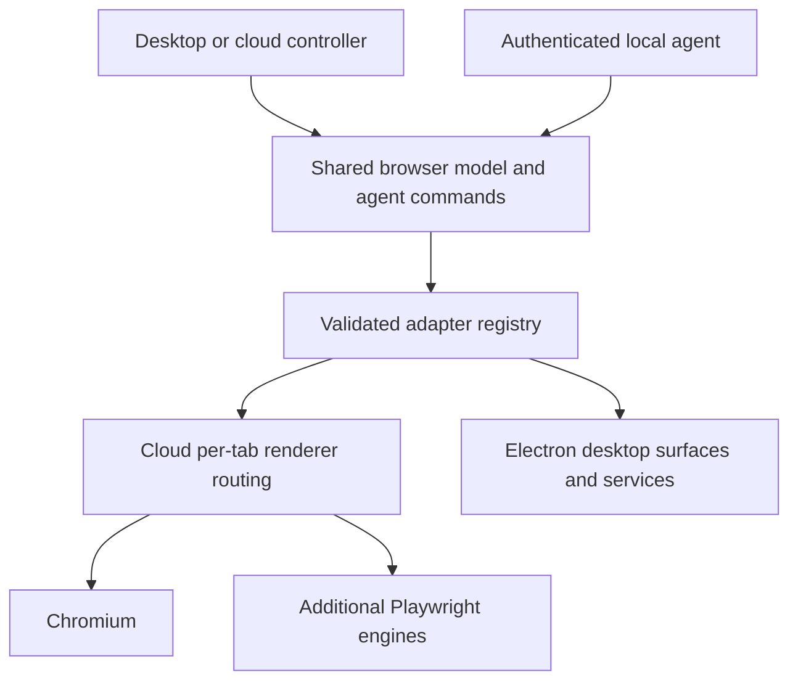

# Portable Chromium browser

This port runs real Chromium on a Linux cloud host and in an Electron desktop application. It shares a browser model and versioned agent protocol across hosts. The original Swift application remains separate. `parity` reports availability and remaining work; **full native mobile and original-app parity are not complete**.

## Cloud development

Requires Node 22.12+ and Chromium. This environment provides Node 24, Chromium, Electron, Xorg, and the dummy display driver.

```sh
cd /workspace/Search/ports/chromium
npm ci
NODE_USE_ENV_PROXY=1 electron_config_cache=/workspace/.electron-cache node node_modules/electron/install.js
SEARCH_CHROMIUM_SANDBOX=off npm run cloud
```

The sandbox exception is necessary in this isolated cloud container. Normal desktop startup uses its OS sandbox. Preserve TLS and checksum verification when installing Electron.

The controller binds to loopback port 4317. `SEARCH_PORT`, `SEARCH_PROFILE`, and `SEARCH_CHROMIUM_PATH` override the port, profile and executable. An owner-only `connection.json` in the profile holds the endpoint and token. Tokens stay out of browser local storage and query strings. Host and Origin checks reject rebinding and cross-site requests. This is a local development service, with no public preview configured.

```sh
npm run agent -- '{"do":"manifest"}'
npm run agent -- '{"do":"parity"}'
npm run agent -- '{"do":"open","url":"https://example.com","bench":true}'
npm run agent -- '{"do":"tabs"}'
```

The agent also reads JSON requests from stdin, one per line. Errors are structured and set a nonzero exit status. Agent-owned tabs stay out of history/session restore and do not take selection by default. `close` with `id:"all"` closes only agent-owned tabs. Commands are serialized. This is a common protocol, rather than a drop-in replacement for the original AppKit test socket and `bench` CLI.

## Desktop

```sh
npm start
```

Desktop pages are actual Chromium surfaces with Node integration disabled, context isolation, web security, and the sandbox. Remote sites have an isolated policy/form preload, with no shell bridge. The shell has narrowly checked IPC. Extension pages and workers receive separate, origin-checked extension bridges.

Desktop profiles live under the platform application-data directory in `Search Chromium`, or `SEARCH_PROFILE`. Enable **Let a local agent drive this browser** in Settings to use the same agent transport as the cloud host. It starts on a random loopback port, requires a generated token, and writes owner-only connection metadata. It is off by default. `--agent` or `SEARCH_AGENT_PORT` enables it at startup. Set the CLI's `SEARCH_PROFILE` to that desktop profile when connecting.

The desktop includes ordinary site-permission prompts, external links/default-browser registration, context menus, print, devtools, and live-page floating video. Linux behavior is tested; default-browser registration, cameras/devices, printers, and real hardware passkeys still need platform validation.

## Shared features

- Address/search with six engines, custom templates and local autocomplete.
- Tab search, pin, rename, duplicate, reorder, close/reopen, lazy restore and zoom.
- Groups with drag membership, colour, icon, fold, move, close/reopen, bookmark and conversion into a space.
- Spaces sharing sign-ins by default, or fresh isolated stores; switch/swipe command, rename, reorder, delete and tab moves. Moving a live tab between shared stores keeps its page. Moving into an isolated store requires explicit reload acceptance.
- Reader mode with lazy-image repair and known video embeds; visual hide picker, per-site review and restore, and document-start styles.
- Original tracker and cosmetic lists, site overrides, and Chromium service-worker network interception.
- Bookmark/history search, editing, JSON import/export and HTML bookmark import.
- Individual download IDs, cloud byte downloads and desktop save dialogs. Completed normal downloads remain saveable after their source tab closes.

Private tabs use separate memory-only stores. They do not enter saved tabs, history, bookmarks, groups, password operations or normal download records. Closing a private tab clears its context and temporary downloads. Profile persistence never writes private renderer state or page checkpoints.

Idle sleep keeps ordinary forms, selection, scroll and session storage in memory. It refuses pages holding passwords, sensitive fields, files or playing media. It does not preserve arbitrary JavaScript state, navigation stacks, service-worker caches or runtime activity. Checkpoints are removed after restoration and excluded from snapshots/profile files.

## Renderer and agent mapping



[src/contract.js](src/contract.js) defines adapter identity, API version, required methods and capability validation. [src/protocol.js](src/protocol.js) describes commands and the feature baseline. [src/renderer-router.js](src/renderer-router.js) keeps the live tab-to-renderer mapping. Executable paths and adapter code are configured at host startup; agent requests cannot load arbitrary plugins.

```sh
SEARCH_RENDERERS='{"chromium-alt":"/path/to/chromium","firefox":{"kind":"firefox"},"webkit":{"kind":"webkit"}}' npm run cloud
```

```json
{"do":"require","features":["automation","screenshots"]}
{"do":"renderer-set","engine":"chromium-alt"}
{"do":"renderer-map"}
```

`renderer-set` changes the renderer for **new tabs**. Existing pages retain their live engine, JavaScript objects, forms, media and private context. New renderers use separate sign-in stores. Failed startup leaves the previous default and all existing pages usable. Saved normal tabs retain their renderer mapping across restart. Only Chromium-to-Chromium routing has been exercised here.

For a full reload migration, `engine` requires `reload:true`. Compatible Playwright hosts transfer cookies, local storage, IndexedDB, per-tab session storage, ordinary form values and scroll. Secret fields, file selections and playing media block migration. Required capabilities are checked before launching; failed candidates roll back without closing the old host. Mixed live renderers must be kept in place or reduced to one before this migration.

A reload cannot transfer an engine's live JavaScript heap, navigation stack, media state, or service-worker caches. Electron native-store migration and connection to the original Swift/WebKit host remain incomplete. Additional Firefox/WebKit binaries could not be downloaded here: `cdn.playwright.dev` and `playwright.download.prss.microsoft.com` returned policy-denied 403 responses. Their implementations are unverified until matching binaries are installed and tested.

## Desktop services

**Passwords:** the entire vault document is encrypted using Electron's OS-backed `safeStorage`, including account metadata. Linux `basic_text` and unavailable backends are refused. Passwords can be saved manually or offered after a sign-in settles, updated, removed, imported from quoted CSV and filled only on their exact origin. Lists never return password values. Save offers require explicit product approval and stay out of shell state. This cloud image has no usable OS keyring; encryption abstractions and rejection of insecure fallback are tested, rather than a real unlocked system vault. OS reauthentication/reveal and direct import from another browser's encrypted database remain.

**Extensions:** CRX3 RSA/EC signatures and store identity are checked before bounded, traversal-safe ZIP extraction. Unpacked folders reject symlinks and get a stable identity. Permission review, enable/disable, pin, remove, reload and popups are implemented. Permission changes block unattended reload. Electron's content scripts/storage are supplemented with real browser tab/window APIs, scoped activeTab grants and isolated top-frame scripting. Private tabs are excluded from host APIs. Full Chrome API compatibility, extension workers and a broad extension corpus remain unverified; Chromium alone does not guarantee Chrome Web Store parity.

**Native messaging:** extension origin, enabled status, `nativeMessaging` permission, explicit session approval and the host manifest's allowed origin are required. Messages use bounded Chrome stdio framing with per-extension connection ownership. Native popup messaging is exercised against a local echo host. Linux/macOS Chrome host folders and Windows Chrome/Chromium/Edge registry discovery are supported in source; actual Windows/macOS discovery and hosts still need testing.

**Updates:** set `SEARCH_UPDATE_FEED` and `SEARCH_UPDATE_PUBLIC_KEY_FILE` to a distributor-owned HTTPS feed and Ed25519 public key. Feed signatures, expiry, newer version, platform/architecture, exact size and SHA256 are verified before an artifact is staged using bounded streaming. `scripts/sign-update.js` creates a release envelope from an existing private-key file; it never uploads artifacts or generates production credentials. Staging is implemented; automatic OS installation, OS code signing/notarization and a production release feed remain. No signing keys or external service credentials are needed for local fixture tests.

## Packaging and validation

Distribution uses the distinct name **Browser Lab**, a stock development icon, and includes the original MIT license. It does not redistribute the original app icon. Local packages are development builds.

```sh
npm run pack
npm run dist:linux
npm run dist:windows
npm run dist:mac
```

Linux x64 AppImage and Debian packages have been built here. Windows NSIS and macOS DMG/ZIP targets are configured, with a CI workflow in [../../.github/workflows/chromium-port.yml](../../.github/workflows/chromium-port.yml). Those platforms have not been executed in this environment. No releases have been published.

For this cloud image, use a writable builder cache and the installed Electron binary:

```sh
NODE_USE_ENV_PROXY=1 ELECTRON_BUILDER_CACHE=/workspace/.electron-builder-cache npm run dist:linux -- --x64 -c.electronDist=node_modules/electron/dist
SEARCH_CHROMIUM_SANDBOX=off npm test
npm run test:desktop:cloud
SEARCH_SMOKE_EXECUTABLE="$PWD/dist/linux-unpacked/browser-lab" npm run test:desktop:cloud
```

The 30-check suite uses actual Chromium and local fixtures. It covers navigation, trusted input, private/shared/isolated stores, groups, state recovery, prepaint hiding, service-worker blocking, downloads after tab closure, renderer routing/migration/rollback, authenticated transport, responsive UI, vault encryption, update/CRX verification, native framing and extension permission boundaries. The packaged Electron smoke additionally exercises virtual WebAuthn, live-page picture-in-picture, extension content scripts, real tab APIs, isolated script injection, native messaging, stable reload and secure-vault availability. Virtual WebAuthn does not validate real hardware or system passkey providers. Cloud smoke disables the OS sandbox only for the isolated container and does not verify production OS sandbox operation.

## Remaining platform work

`parity.complete` remains false. Native offline Android/iOS hosts are missing. The phone/tablet controller has touch scrolling and soft-keyboard input, but it depends on the running cloud host and does not provide live audio/video streaming, page accessibility or mobile platform services. Android WebView does not provide a true memory-only private profile, so a plain WebView wrapper cannot meet the privacy contract. iOS native builds require macOS/Xcode and provisioning; a Chromium embedding/distribution route would also need to be selected for the target region/platform.

Further acceptance work includes full extension API/corpus coverage, real OS vaults and passkey devices, printing/device permission flows, Windows/macOS execution and installers, production signing/update installation, additional renderer binaries and native storage migration. These are explicit limits rather than silently reduced capabilities.
